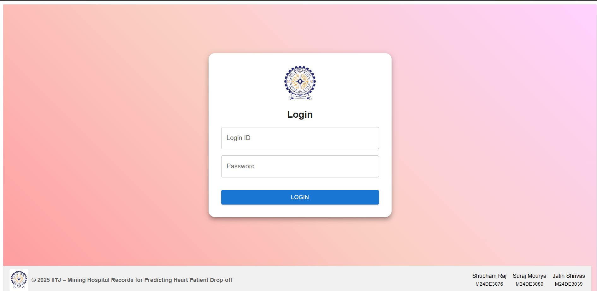
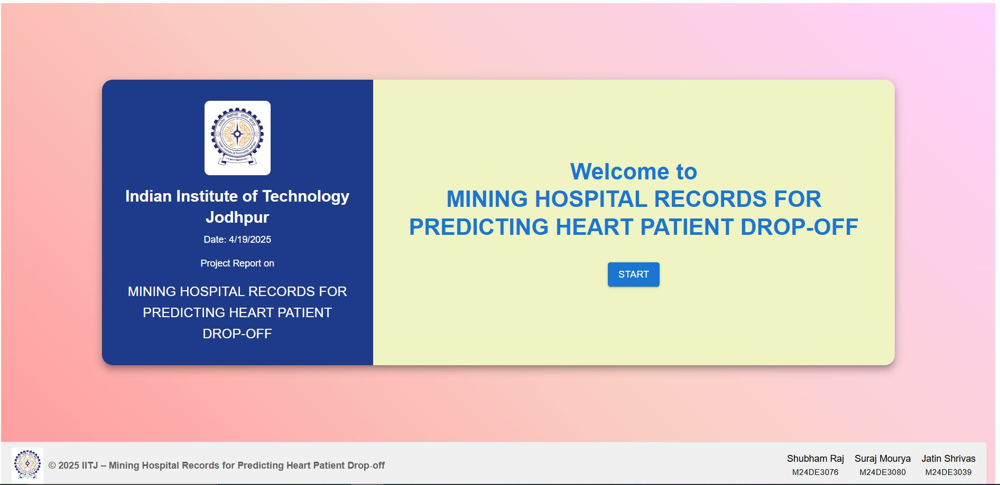
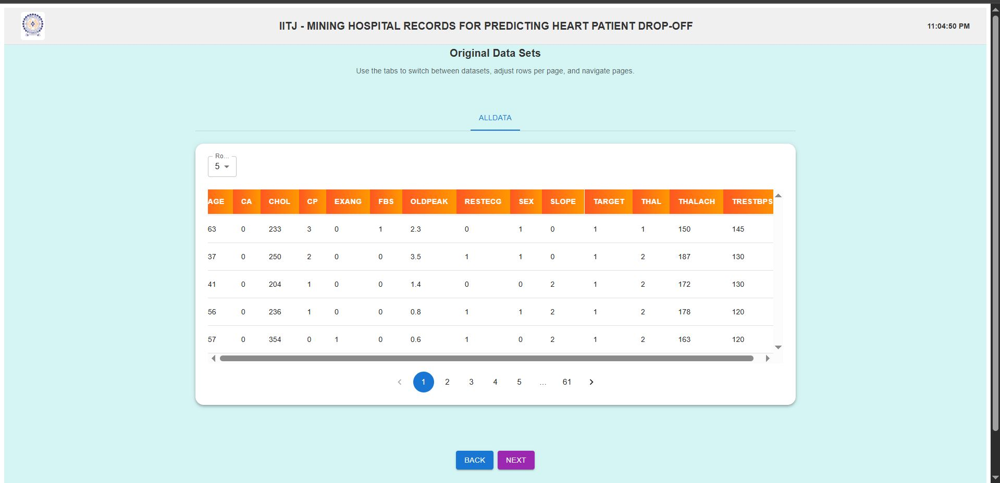
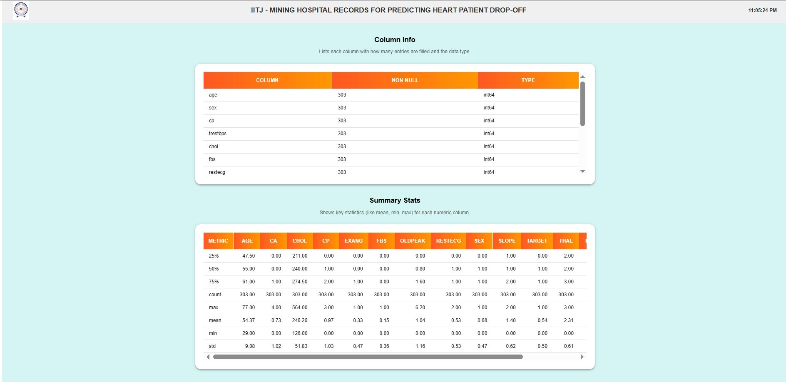
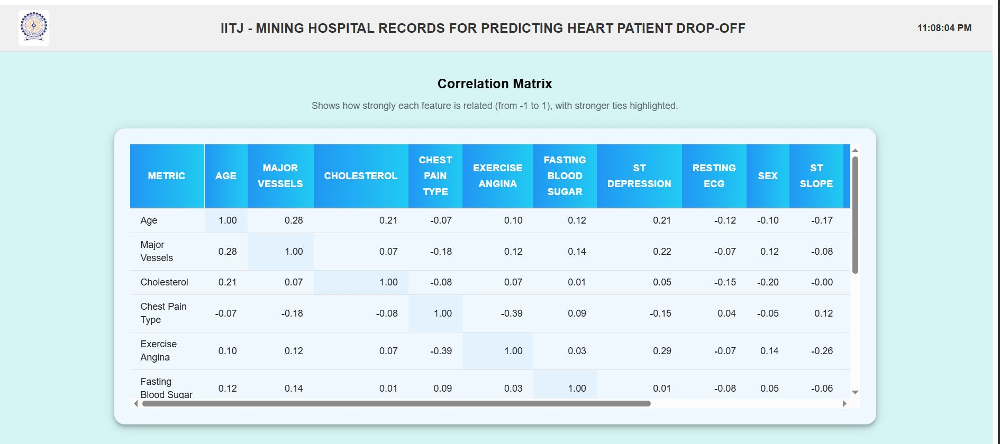
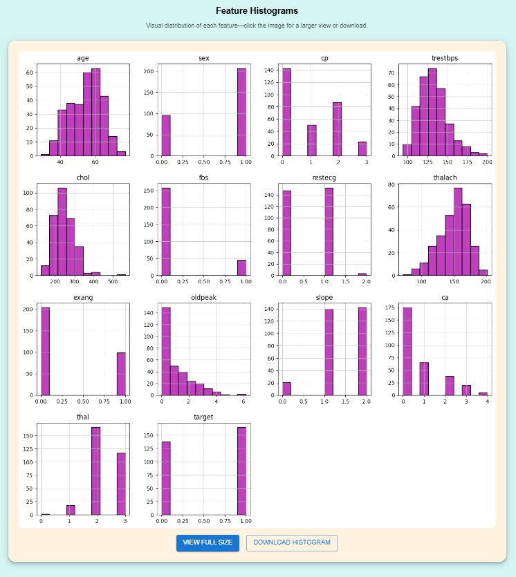
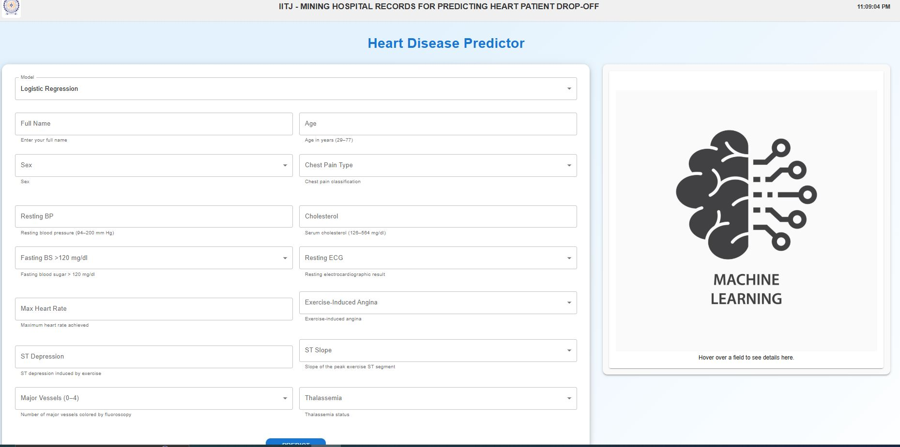
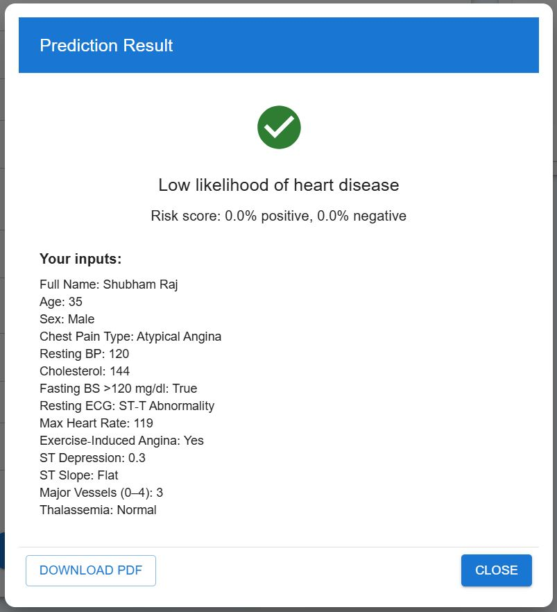
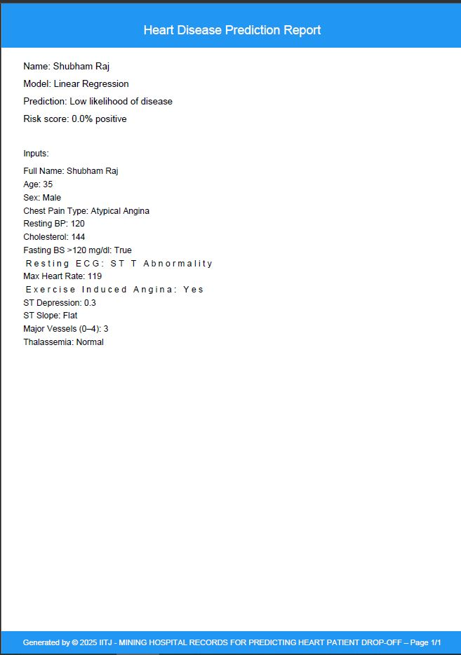

# IITJ-MINING HOSPITAL RECORDS FOR PREDICTING HEART PATIENT DROP-OFF
IITJ MINING HOSPITAL RECORDS FOR PREDICTING HEART PATIENT DROP-OFF

[![Contributors][contributors-shield]][contributors-url]  
[![Forks][forks-shield]][forks-url]  
[![Stargazers][stars-shield]][stars-url]  
![Issues][issues-shield]

---

## Overview

This project focuses on cleaning, processing, and performing advanced analysis of hospital records to predict heart patient drop-off. It integrates advanced visualization tools, machine learning models, and data processing pipelines for comprehensive exploration and decision-making.

---

## Requirements
- **Python 3.10+**
- **Node.js 18+**
- **Flask** for backend
- **React.js** for frontend
- **Redux Toolkit** for state management
- **Material-UI** for UI components

---

## Live Project Links
- **UI:** [http://13.51.18.127:5173/](http://13.51.18.127:5173/)
- **Backend:** [http://13.49.123.34:5000/api/data](http://13.49.123.34:5000/api/data)

User Name : **admin** || Password: **admin** 
---

## Setup Instructions

### Backend Setup

#### Step 1: Create and Activate Python Virtual Environment

1. **Create a Virtual Environment**:
    ```bash
    python3.10 -m venv veenv
    ```

2. **Activate Virtual Environment**:
   - **Command Prompt**:
     ```bash
     venv\Scripts\activate
     ```
   - **PowerShell**:
     ```bash
     .\venv\Scripts\Activate
     ```
   - **Git Bash**:
     ```bash
     source venv/Scripts/activate
     ```

# Install requirements
python -m pip install --upgrade pip setuptools wheel
pip install -r requirements.txt

#### Step 2: Install Python Dependencies
Install the required Python packages using the `requirements.txt` file:
```bash
pip install -r requirements.txt
```

#### Step 3: Run the Flask Backend
Start the Flask app:
```bash
python run.py
```

---

### Frontend Setup

#### Step 1: Install Node.js Dependencies
Navigate to the project root directory and install the required packages:
```bash
npm install
```

#### Step 2: Run the Frontend Application
Start the development server:
```bash
npm run dev
```

---

## Folder Structure
```
project-root/
├── backend/                # Backend code
│   ├── app/                # Flask app
│   │   ├── __init__.py     # Flask app factory
│   │   ├── routes.py       # API routes
│   ├── csv/                # Dataset folder
│   │   ├── data.csv        # Heart disease dataset
│   ├── requirements.txt    # Python dependencies
│   ├── run.py              # Entry point for Flask app
├── src/                    # Frontend React code
│   ├── components/         # React components
│   ├── layout/             # Layout components
│   ├── slice/              # Redux slices
│   ├── ui/                 # UI components
│   ├── App.jsx             # Main application file
│   ├── main.jsx            # Entry point for React
│   ├── store.jsx           # Redux store configuration
├── assets/                 # Static assets
├── README.md               # Project documentation
├── package.json            # Node.js dependencies
├── vite.config.js          # Vite configuration
```
Model | Accuracy (%)
Logistic Regression | 78.69
Support Vector Machine | 77.04
Naive Bayes | 72.13
Decision Tree | 72.13
K-Nearest Neighbors | 54.10
Linear Regression | 24.35
Random Forest Regressor | 29.76
Gradient Boosting Regr. | 26.14
XGBoost | 16.39
---

## Features

### Backend
- **Flask API** for data processing and machine learning predictions.
- **Endpoints** for:
  - Data cleaning (`/api/data/clean`)
  - Data visualization (`/api/data/corr`, `/api/data/hist`)
  - Machine learning predictions (`/api/<model_name>/predict`)
- **Machine Learning Models**:
  - Logistic Regression
  - Decision Tree
  - Random Forest
  - Gradient Boosting
  - XGBoost
  - Logistic Regression
  - Svm
  - Naive Bayes

### Frontend
- **React.js** for building the user interface.
- **Material-UI** for responsive and modern design.
- **Redux Toolkit** for state management.
- **Features**:
  - Login and authentication.
  - Data analysis, cleaning, and visualization.
  - Machine learning model selection and prediction.

---

## Screenshots

### Login Screen


### Landing Page


### Data Analysis


### Data Info


### Data Cleaning


### Data Visualization



### Prediction Form


### Prediction Results


### Prediction Results PDF


---

## Technologies Used

### Backend
- **Flask**
- **Flask-CORS**
- **Pandas** for data processing
- **Scikit-Learn** for machine learning
- **XGBoost** for advanced modeling
- **Logistic Regression**
- **Svm**
- **Naive Bayes**

### Frontend
- **React.js**
- **Redux Toolkit**
- **Material-UI**
- **Chart.js** for visualizations
- **JSPDF** for PDF Download

---

## Authors

👤 **Shubham Raj**  
- GitHub: [@ShubhamRaj](https://github.com/shubham14p3)  
- LinkedIn: [Shubham Raj](https://www.linkedin.com/in/shubham14p3/)

👤 **Suraj Mourya**  
- GitHub: [@Suraj Mourya](https://github.com/)  
- LinkedIn: [Suraj Mourya](https://linkedin.com/in/)

👤 **Jatin Shrivas**  
- GitHub: [@JATINSHRIVAS](https://github.com/)  
- LinkedIn: [Jatin Shrivas](https://linkedin.com/in/)

---

## Future Upgrades

- Add more advanced machine learning models.
- Enhance data visualization with interactive charts.
- Integrate user-specific data upload and analysis.
- Adding more data for more better accuracy.
- Adding new disease dataset for more all round prediction.

---

## Contributions

Feel free to contribute by creating pull requests or submitting issues. Suggestions for improving data processing methods, adding more visualizations, or optimizing the application are welcome.

---

## Show Your Support

Give a ⭐ if you like this project!

---

## Acknowledgments

- Supported by [IIT Jodhpur](https://www.iitj.ac.in/).

---

<!-- MARKDOWN LINKS & IMAGES -->

[contributors-shield]: https://img.shields.io/github/contributors/shubham14p3/IITJ-MINING-HOSPITAL-RECORDS-FOR-PREDICTING-HEART-PATIENT-DROP-OFF.svg?style=flat-square
[contributors-url]: https://github.com/shubham14p3/IITJ-MINING-HOSPITAL-RECORDS-FOR-PREDICTING-HEART-PATIENT-DROP-OFF/graphs/contributors
[forks-shield]: https://img.shields.io/github/forks/shubham14p3/IITJ-MINING-HOSPITAL-RECORDS-FOR-PREDICTING-HEART-PATIENT-DROP-OFF.svg?style=flat-square
[forks-url]: https://github.com/shubham14p3/IITJ-MINING-HOSPITAL-RECORDS-FOR-PREDICTING-HEART-PATIENT-DROP-OFF/network/members
[stars-shield]: https://img.shields.io/github/stars/shubham14p3/IITJ-MINING-HOSPITAL-RECORDS-FOR-PREDICTING-HEART-PATIENT-DROP-OFF.svg?style=flat-square
[stars-url]: https://github.com/shubham14p3/IITJ-MINING-HOSPITAL-RECORDS-FOR-PREDICTING-HEART-PATIENT-DROP-OFF/stargazers
[issues-shield]: https://img.shields.io/github/issues/shubham14p3/IITJ-MINING-HOSPITAL-RECORDS-FOR-PREDICTING-HEART-PATIENT-DROP-OFF.svg?style=flat-square
